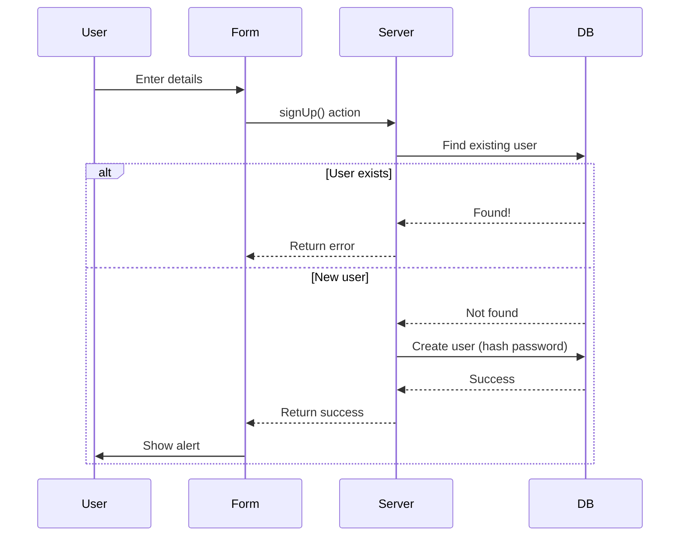
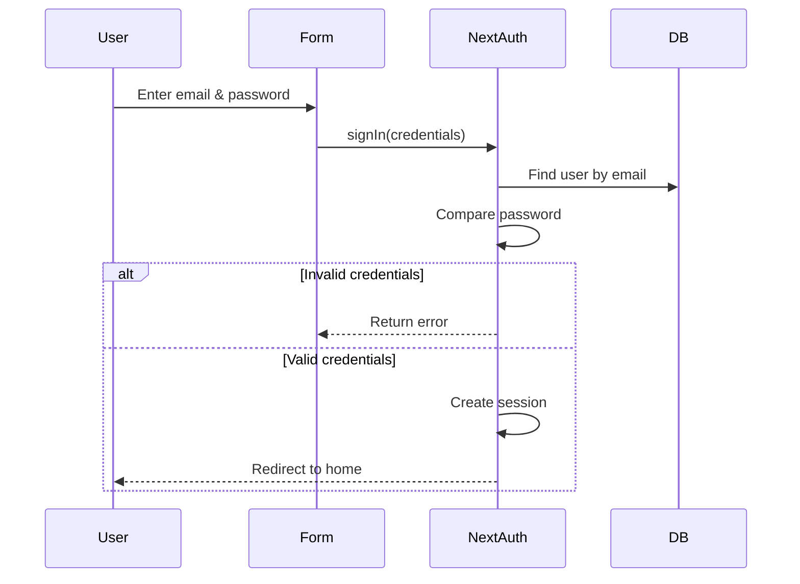

# Esperanza 2k26 - Complete Setup & Architecture Guide

<p align="center">
  
</p>

---

## Table of Contents

- [Prerequisites](#prerequisites)
- [Local Development Setup](#local-development-setup)
- [Project Architecture](#project-architecture)
- [Authentication Flow](#authentication-flow)
- [Key Features Explained](#key-features-explained)
- [Troubleshooting](#troubleshooting)

---

## Prerequisites

> [!IMPORTANT]
> Ensure you have these installed before proceeding:
>
> | Tool | Version | Purpose |
> |------|---------|---------|
> | Node.js | ≥ 18 | Runtime environment |
> | npm | Latest | Package manager |
> | MongoDB | ≥ 5 (or MongoDB Atlas) | Database |

---

## Local Development Setup

### 1️⃣ Clone the Repository

```bash
git clone <repository-url>
cd Esperanza_2k25
```

### 2️⃣ Install Dependencies

```bash
npm install
```

### 3️⃣ Environment Variables

Create a `.env.local` file in the root of the project with the following content:

```env
MONGO_URI=
DB_NAME=esperanza2k26

# NextAuth Configuration
AUTH_SECRET=
# Generate one using: openssl rand -base64 32


# NextAuth URL (for development)
NEXTAUTH_URL=http://localhost:3000

GMAIL_USER=
GMAIL_PASS=
BREVO_API_KEY=

CLOUDINARY_CLOUD_NAME=
CLOUDINARY_API_KEY=
CLOUDINARY_API_SECRET=
```

### 4️⃣ Start MongoDB

Choose one option:
- **Local**: Make sure MongoDB service is running
- **Atlas**: Ensure your IP is whitelisted in Atlas dashboard

### 5️⃣ Seed Initial Data (Optional)

```bash
# Seed events
npm run seed:events

# Seed events and overwrite existing ones
npm run seed:events:force

# Seed admin user
npm run seed:admin
```

### 6️⃣ Run Development Server

```bash
npm run dev
```

> [!TIP]
> Open your browser and navigate to [http://localhost:3000](http://localhost:3000)

---

## Project Architecture

```
Esperanza_2k25/
├── public/
│   ├── brochure/
│   ├── terms-condition/
│   └── videos/
├── src/
│   ├── actions/                # Server Actions
│   │   ├── admin/             # Admin-related actions
│   │   │   ├── crew.action.ts
│   │   │   ├── dashboard.action.ts
│   │   │   ├── events.action.ts
│   │   │   ├── messages.action.ts
│   │   │   ├── participants.action.ts
│   │   │   ├── settings.action.ts
│   │   │   └── users.action.ts
│   │   ├── contact.action.ts
│   │   ├── crew.action.ts
│   │   ├── eventRegister.action.ts
│   │   ├── fetch.action.ts
│   │   ├── forgotPassword.action.ts
│   │   ├── login.action.ts
│   │   ├── logout.action.ts
│   │   ├── profile.action.ts
│   │   ├── settings.action.ts
│   │   ├── signup.action.ts
│   │   └── team.action.ts
│   ├── app/                    # Next.js App Router
│   │   ├── (admin)/admin/     # Admin panel routes
│   │   ├── about/
│   │   ├── api/
│   │   ├── developers/
│   │   ├── events/
│   │   ├── gallery/
│   │   ├── login/
│   │   ├── profile/
│   │   ├── sponsers/
│   │   ├── team/
│   │   ├── globals.css
│   │   ├── layout.tsx
│   │   └── page.tsx
│   ├── assets/                # Images, backgrounds, etc.
│   ├── components/            # React Components
│   ├── interfaces/            # TypeScript Interfaces
│   ├── models/                # Mongoose Models
│   └── utils/
│       ├── db/
│       ├── cloudinary.ts
│       └── swal.ts
├── .gitignore
├── README.md
├── SETUP_GUIDE.md
├── components.json
├── eslint.config.mjs
├── middleware.ts
├── next.config.ts
├── package.json
└── postcss.config.mjs
```

---

## Authentication Flow

### Sign Up Process



### Login Process



---

## Key Features Explained

### 🔐 Admin Panel

- Dashboard with statistics
- User management
- Event management
- Crew management
- Participant tracking
- Messages & settings

### 👥 Team Management

- Create teams with unique keys
- Join existing teams using keys
- Leader can remove members
- Auto transfer leadership if leader leaves

### 📷 Profile Photo Upload

- Powered by Cloudinary
- Animated UI with fire effects
- Max size: 5MB
- Preview before saving

---

## Troubleshooting

### MongoDB Connection Issues

- Check if MongoDB service is running
- Verify `MONGO_URI` and `DB_NAME`
- For Atlas, check IP whitelist and credentials

### NextAuth Issues

- Ensure `AUTH_SECRET` is set
- Check `NEXTAUTH_URL`
- Generate a new auth secret: `openssl rand -base64 32`

### Port Already in Use

```bash
# Run on a different port
npm run dev -- -p 3001
```

---

## Available Scripts

```bash
npm run dev          # Start dev server with Turbopack
npm run build        # Build for production


npm start            # Start production server
npm run lint         # Run ESLint


npm run seed:admin   # Seed admin user
npm run seed:events  # Seed events
```

---

<p align="center">Made with ❤️ for CGEC Esperanza</p>
